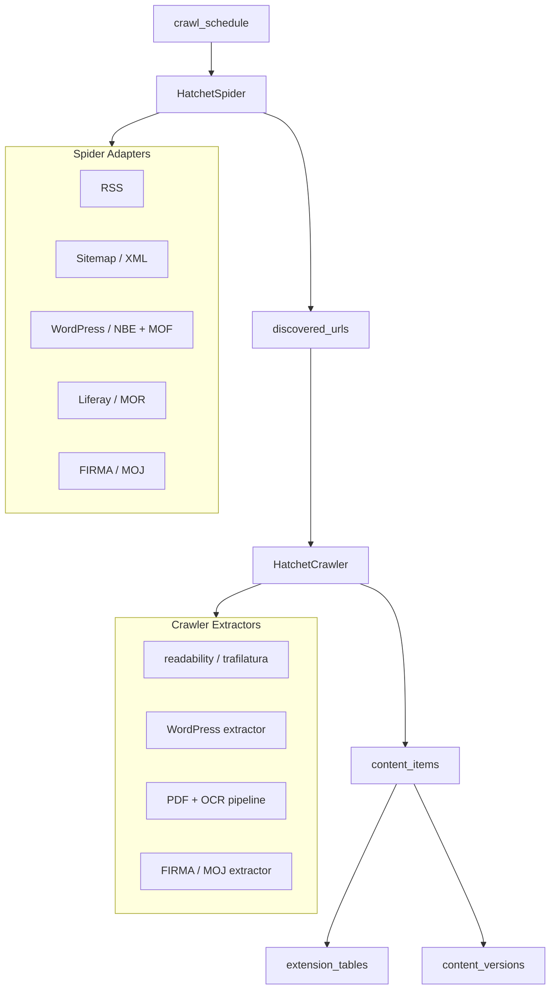

# Ethiopia Intelligence Pipeline — Phase Index

Build a production-grade, continuously-running Ethiopian government and news intelligence system that scrapes directly from government and news websites (NBE, MOF, MOR, MOJ, and others).

## Architecture

## Layer Responsibilities

| Layer | Responsibility |
|-------|---------------|
| Spider | Discover URLs only |
| Crawler | Fetch pages + extract content |
| Extractor | Parse raw HTML → structured dict |
| Ingestion | Persist + deduplicate + version |
| Hatchet | Orchestrate workflows |
| DB | Source of truth |

## Phases

| Phase | File | Week | Status |
|-------|------|------|--------|
| 1 — Foundation | [phase-1-foundation.md](phase-1-foundation.md) | Week 1 | pending |
| 2 — Spider | [phase-2-spider.md](phase-2-spider.md) | Week 2 | pending |
| 3 — Crawler | [phase-3-crawler.md](phase-3-crawler.md) | Week 3 | pending |
| 4 — PDF Pipeline | [phase-4-pdf-pipeline.md](phase-4-pdf-pipeline.md) | Week 4 | pending |
| 5 — Ingestion Layer | [phase-5-ingestion.md](phase-5-ingestion.md) | Week 4 | pending |
| 6 — Hatchet Workflows | [phase-6-hatchet.md](phase-6-hatchet.md) | Week 5 | pending |
| 7 — Source Health | [phase-7-source-health.md](phase-7-source-health.md) | Week 5 | pending |
| 8 — Monitoring & Replay | [phase-8-monitoring.md](phase-8-monitoring.md) | Week 5+ | pending |

## Tech Stack

| Component | Library |
|-----------|---------|
| Language | Python 3.11 |
| Workflow orchestration | Hatchet (`hatchet-sdk`) |
| DB | PostgreSQL |
| ORM | SQLAlchemy 2.x async |
| Migrations | Alembic |
| HTTP client | httpx (async) |
| HTML parsing | selectolax + BeautifulSoup |
| Content extraction | trafilatura + readability-lxml |
| PDF text | pdfplumber |
| OCR | pytesseract + Tesseract (amh+eng) |
| Language detection | lingua-py |
| Hashing | hashlib (sha256) |
| JS-rendered pages | Playwright (MOR Liferay fallback) |
| Object storage | GCS |

## Current Repo State

Run `git restore .` first — all tracked files are currently deleted on disk.

The existing `telegram_scraper/` is left as-is and is **not** integrated into this pipeline.
