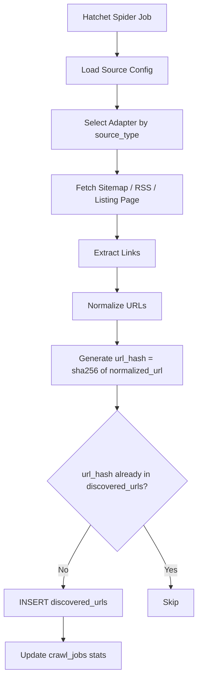

# Phase 2 — Spider

**Week:** 2  
**Goal:** URL discovery only. The spider never extracts content — it only fills `discovered_urls`.  
**Depends on:** Phase 1 (schema + DB must be running)

---

## Deliverables

- [x] `SpiderAdapter` base class
- [x] 5 source adapters (RSS, Sitemap, WordPress, Liferay, FIRMA)
- [x] URL normalization utility
- [x] NBE directive number extractor (pre-fetch, from URL slug)
- [x] `discovered_urls` insert with deduplication
- [x] Manual smoke test: active sources discover and insert URLs from live sites

---

## What the Spider Does



---

## 1. Base Adapter Interface

**File:** `pipeline/spider/adapters/base.py`

```python
from abc import ABC, abstractmethod
from pipeline.db.models.sources import Source

class SpiderAdapter(ABC):
    @abstractmethod
    async def discover_urls(self, source: Source) -> list[str]:
        """Return a list of raw (un-normalized) URLs discovered from this source."""
        ...
```

Every adapter returns a plain `list[str]`. Normalization and deduplication happen outside the adapter — adapters are pure discovery.

---

## 2. Adapters

### RSS Adapter (`pipeline/spider/adapters/rss.py`)

- Library: `feedparser`
- Covers: MOF (`/press-media/news/` feed if found), any RSS-enabled source
- Fallback: if no feed auto-discovered, try `/feed/`, `/rss/`, `/atom.xml`

```python
import feedparser

class RSSAdapter(SpiderAdapter):
    async def discover_urls(self, source: Source) -> list[str]:
        feed_url = source.selectors.get("rss_url") or f"{source.url}/feed/"
        parsed = feedparser.parse(feed_url)
        return [entry.link for entry in parsed.entries if entry.get("link")]
```

### Sitemap Adapter (`pipeline/spider/adapters/sitemap.py`)

- Library: `httpx` + `lxml` XML parse
- Covers: NBE (has `/sitemap.xml`), any standard sitemap
- Handles: sitemap index files (recursively fetch child sitemaps)

Key logic:
1. Fetch `/sitemap.xml`
2. If `<sitemapindex>`, fetch each child `<loc>` and recurse
3. Collect all `<url><loc>` entries
4. Filter by URL pattern from `source.selectors["article_url_pattern"]`

### WordPress Adapter (`pipeline/spider/adapters/wordpress.py`)

- Covers: NBE (`nbe_news` custom post type), MOF (`/blog/`)
- Approach: WP REST API (`/wp-json/wp/v2/posts?per_page=100&page=N`) + category listing crawl

```python
# NBE: custom post type
GET /wp-json/wp/v2/nbe_news?per_page=100&page=1
# MOF: standard posts
GET /wp-json/wp/v2/posts?per_page=100&page=1
```

Pagination: keep fetching until response is empty or 404. Extract `link` field from each post object.

Also crawl listing pages as a fallback:
- NBE: `/news/press-release/`, `/all-news/`, `/mandates/directives/`
- MOF: `/press-media/news/`, `/mof-directive/` subcategories

### Liferay Adapter (`pipeline/spider/adapters/liferay.py`)

- Covers: MOR (`www.mor.gov.et` — Liferay portal)
- Primary: HTML link discovery from MOR seed paths (robots-aware)
- Fallback: configured `seed_urls` / `canary_urls` when extraction yields no links

```python
# Discover links from known Liferay paths, then filter to doc-like URLs.
# If extraction is empty, return stable canary/seed URLs so crawl can proceed.
```

Note: Some MOR paths are blocked in `robots.txt`. Check before fetching.

### FIRMA Adapter (`pipeline/spider/adapters/firma.py`)

- Covers: MOJ (`justice.gov.et` — FIRMA CMS)
- Listing page: `/en/newsroom/` (confirmed; `/en/newsroom/press-releases/` does NOT exist)
- FIRMA backend is unstable — retry logic is mandatory

```python
class FIRMAAdapter(SpiderAdapter):
    MAX_RETRIES = 5

    async def discover_urls(self, source: Source) -> list[str]:
        listing_url = f"{source.url}/en/newsroom/"
        # retry with exponential backoff
        # parse <a href> from listing HTML
        # return absolute URLs
```

---

## 3. URL Normalization (`pipeline/utils/url_normalizer.py`)

Applied to every URL before inserting into `discovered_urls`.

### Rules (in order)

1. Parse with `urllib.parse.urlparse`
2. Strip fragment (`#...`)
3. Strip UTM and tracking query params (`utm_*`, `fbclid`, `gclid`, etc.)
4. Strip trailing slash from path
5. Normalize `www.` — remove it (canonical form has no `www.`)
6. Lowercase scheme and host
7. Decode percent-encoded Ethiopic characters for the display field; **keep raw URL for the fetch field**
8. Reconstruct URL

```python
import hashlib
from urllib.parse import urlparse, urlencode, parse_qsl, urlunparse

STRIP_PARAMS = {"utm_source", "utm_medium", "utm_campaign", "utm_content",
                "utm_term", "fbclid", "gclid", "ref", "source"}

def normalize_url(raw_url: str) -> str:
    p = urlparse(raw_url)
    host = p.netloc.lower().removeprefix("www.")
    params = [(k, v) for k, v in parse_qsl(p.query) if k not in STRIP_PARAMS]
    clean = urlunparse((p.scheme, host, p.path.rstrip("/"), "", urlencode(params), ""))
    return clean

def url_hash(normalized_url: str) -> str:
    return hashlib.sha256(normalized_url.encode()).hexdigest()
```

---

## 4. NBE Directive Number Extraction (pre-fetch)

Extract from the URL slug **before any HTTP request** — saves a fetch when data is already in the URL.

```python
import re

DIRECTIVE_REGEX = re.compile(r'/files/([a-z](?:[a-z-]*[a-z])?)-(\d+)-(\d{4})/?$')

def extract_directive_meta(path: str) -> dict | None:
    m = DIRECTIVE_REGEX.search(path)
    if not m:
        return None
    return {
        "directive_type_code": m.group(1).upper().replace("-", "_"),
        "directive_number": m.group(2),
        "directive_year": int(m.group(3)),
    }
```

Examples:
- `/files/fxd-04-2026/` → `{type: "FXD", number: "04", year: 2026}`
- `/files/sib-62-2026/` → `{type: "SIB", number: "62", year: 2026}`
- `/files/nbe-int-13-2026/` → `{type: "NBE_INT", number: "13", year: 2026}`

Store the extracted metadata in `discovered_urls.link_metadata` JSONB so the crawler can access it without re-parsing the URL.

---

## 5. Inserting to `discovered_urls`

```python
async def insert_discovered_url(session, source_id, raw_url, link_metadata=None):
    normalized = normalize_url(raw_url)
    hash_ = url_hash(normalized)
    stmt = pg_insert(DiscoveredUrl).values(
        source_id=source_id,
        normalized_url=normalized,
        url_hash=hash_,
        link_metadata=link_metadata or {},
        discovered_at=datetime.utcnow(),
    ).on_conflict_do_nothing(index_elements=["url_hash"])
    await session.execute(stmt)
```

---

## Completion Checklist

- [x] All 5 adapters importable and return `list[str]` without errors
- [x] URL normalizer strips UTMs, `www.`, trailing slash, fragments
- [x] Ethiopic percent-encoded slugs decoded correctly (test with `/blog/%E1%8B%A8.../`)
- [x] NBE directive regex matches at least 10 known slug shapes
- [x] `insert_discovered_url` handles duplicate hashes silently (ON CONFLICT DO NOTHING)
- [x] Smoke validation: active sources discover and insert URLs; adapter probes confirm RSS + Liferay paths
- [x] MOR: `robots.txt` fetched and respected before any crawl

## Validation Evidence

- `python -m pytest tests/test_spider_utils.py tests/test_liferay_adapter.py` → `8 passed`
- `python scripts/run_spider.py -s NBE` → `found=439 inserted=439`
- `python scripts/run_spider.py -s MOF` → `found=20 inserted=20`
- `python scripts/run_spider.py -s MOR` → `found=2` with `LiferayAdapter: 1`
- `python scripts/run_spider.py -s MOJ` → `found=1 inserted=1`
- RSS probe against NBE source returned `RSSAdapter urls=8`
