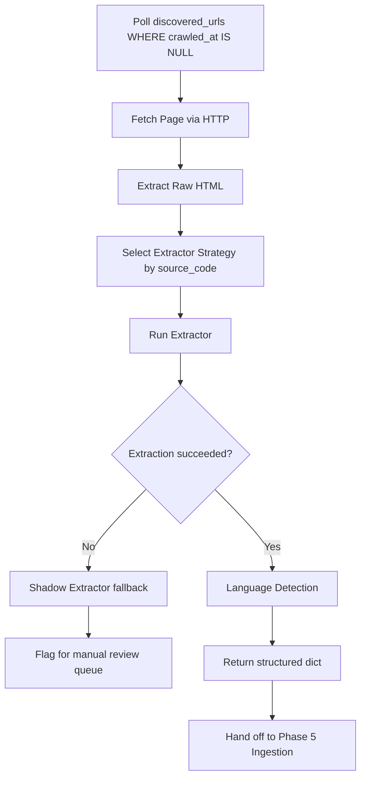

# Phase 3 — Crawler

**Week:** 3  
**Goal:** For each URL in `discovered_urls`, fetch the page and extract a clean structured dict. No DB writes in this phase — the extractor is pure.  
**Depends on:** Phase 1 (schema), Phase 2 (discovered_urls populated)

---

## Deliverables

- [x] HTTP fetcher with rate limiting, retries, robots.txt
- [x] 5 extractor strategies (NBE, MOF, Liferay/MOR, FIRMA/MOJ, generic readability)
- [x] Shadow extractor fallback
- [x] Language detector
- [x] Bilingual pair linker
- [x] Extractor contract enforced (typed return dict)

---

## Crawler Workflow



---

## 1. HTTP Fetcher (`pipeline/crawler/fetcher/http.py`)

The fetcher is the only component that touches the network. It is completely separated from extraction logic.

### Rules

| Rule | Value |
|------|-------|
| Concurrency per host | 2 simultaneous requests max |
| Delay between requests | 500ms ± 200ms jitter |
| Connect timeout | 15 seconds |
| Read timeout | 60 seconds |
| Retry on 429/503 | Exponential backoff; honor `Retry-After` header |
| User-Agent | `BerhanAdvisorBot/1.0 (+https://berhanadvisor.com/bot)` |
| robots.txt | Enforced; MOR is mandatory, others expected |

```python
import asyncio, random, httpx
from urllib.robotparser import RobotFileParser

class HTTPFetcher:
    def __init__(self):
        self._semaphores: dict[str, asyncio.Semaphore] = {}
        self._robots_cache: dict[str, RobotFileParser] = {}
        self.client = httpx.AsyncClient(
            headers={"User-Agent": "BerhanAdvisorBot/1.0 (+https://berhanadvisor.com/bot)"},
            timeout=httpx.Timeout(connect=15, read=60, write=10, pool=5),
            follow_redirects=True,
        )

    async def fetch(self, url: str) -> httpx.Response:
        host = httpx.URL(url).host
        sem = self._semaphores.setdefault(host, asyncio.Semaphore(2))
        async with sem:
            await asyncio.sleep(0.5 + random.uniform(-0.2, 0.2))
            return await self._fetch_with_retry(url)

    async def _fetch_with_retry(self, url, attempt=0):
        try:
            resp = await self.client.get(url)
            if resp.status_code in (429, 503):
                wait = int(resp.headers.get("Retry-After", 2 ** attempt * 5))
                await asyncio.sleep(wait)
                return await self._fetch_with_retry(url, attempt + 1)
            return resp
        except httpx.TransportError:
            if attempt < 4:
                await asyncio.sleep(2 ** attempt)
                return await self._fetch_with_retry(url, attempt + 1)
            raise
```

---

## 2. Extractor Contract

Every extractor is a **pure function** — no DB access, no side effects. It receives raw HTML and returns a typed dict.

```python
from dataclasses import dataclass, field
from datetime import datetime

@dataclass
class ExtractedContent:
    title: str
    content: str                          # cleaned text / markdown
    published_at: datetime | None
    author: str | None
    language: str                         # filled by language detector, not extractor
    attachments: list[dict]               # [{"url": str, "type": "pdf" | "image"}]
    directive_number: str | None          # NBE/MOR directives only
    directive_type_code: str | None       # NBE/MOR directives only
    raw_html: str                         # always store original
    canonical_url: str | None             # from og:url or rel=canonical
```

---

## 3. Extractor Strategies

### NBE Extractor (`pipeline/crawler/extractors/nbe.py`)

Verified selectors (May 2026):

| Field | Selector |
|-------|----------|
| Title | `h1.entry-title` |
| Date | `time.entry-date[datetime]` → use `datetime` attribute |
| Body | `.elementor-widget-text-editor p` (concatenate all) |
| PDF links | `a[href*="/wp-content/uploads/"][href$=".pdf"]` |
| Amharic sibling | `a.nav-previous` or `a.nav-next` (check Ethiopic title text) |

Notes:
- Directive number and type extracted from URL slug via Phase 2 regex (passed in via `link_metadata`)
- Always extract embedded PDF `href` links and add to `attachments`
- Elementor adds heavy wrapper divs — target semantic content selectors, not positional XPath

### MOF Extractor (`pipeline/crawler/extractors/mof.py`)

All articles at `/blog/{slug}/`. Django/Mezzanine stack.

| Field | Selector |
|-------|----------|
| Title | `h1` (first) |
| Date | text matching `Month DD, YYYY` near category link (e.g. "News April 19, 2026") |
| Body | `div.blog-detail p` or `article p` |
| PDF links | `a[href*="/media/filer_public/"][href$=".pdf"]` |

Notes:
- `/press-media/press-release/` is stale (last updated 2022) — use `/press-media/news/` as primary
- Amharic articles have percent-encoded Ethiopic slugs — store raw URL, decode for display
- `og:url` is reliable for canonical resolution on MOF

### Liferay / MOR Extractor (`pipeline/crawler/extractors/liferay.py`)

Liferay portal. Primary documents are in the document library with numeric IDs.

| Field | Selector / Strategy |
|-------|---------------------|
| Title | `h1` or document library title field |
| Date | `time` element or Liferay metadata field |
| Body | Liferay article body or linked PDF (most MOR content is PDF-first) |
| PDF links | Liferay document download URL (`/documents/{groupId}/{folderId}/{fileName}`) |

Notes:
- Many MOR pages are JS-rendered — if `selectolax` parse returns empty body, fall back to **Playwright**
- Some endpoints blocked in `robots.txt` — skip those entirely
- Treat as `document` content_type; most MOR content links to a PDF as the primary source

### FIRMA / MOJ Extractor (`pipeline/crawler/extractors/firma.py`)

FIRMA CMS. Listing at `/en/newsroom/`.

| Field | Selector |
|-------|----------|
| Title | `h1` or `.newsroom-title` |
| Date | `.news-date` or `<time>` |
| Body | `.newsroom-body` or `article .content` |

Notes:
- FIRMA has frequent backend instability (server errors) — retry up to 5× with backoff before giving up
- If 5 retries exhausted, mark `crawl_jobs` as `failed` and increment `consecutive_errors` on `source_crawl_state`
- No reliable sitemap — rely on listing page crawl from Phase 2 FIRMA adapter

### Generic Readability Extractor (`pipeline/crawler/extractors/readability.py`)

Fallback for any source without a specific extractor, or for new sources added later.

```python
import trafilatura

def extract(html: str, url: str) -> ExtractedContent:
    result = trafilatura.extract(
        html,
        include_comments=False,
        include_tables=False,
        output_format="markdown",
        with_metadata=True,
    )
    # parse result.title, result.date, result.text
```

Also try `readability-lxml` if trafilatura returns empty content.

### Shadow Extractor (`pipeline/crawler/extractors/shadow.py`)

Last-resort fallback. Permissive — never fails, always returns something.

Strategy:
1. Title: `<title>` tag, stripped of site name suffix
2. Date: first ISO-shaped string found anywhere in HTML (`\d{4}-\d{2}-\d{2}`)
3. Body: largest contiguous text block by character count (using `selectolax`)

**Output goes to manual review queue** — never directly to `content_items` production path.

```python
SHADOW_REVIEW_QUEUE = "shadow_review"  # separate DB table or queue
```

---

## 4. Language Detection (`pipeline/utils/language_detector.py`)

`lingua-py` with a fast Ethiopic pre-filter.

```python
from lingua import Language, LanguageDetectorBuilder

ETHIOPIC_RANGE = range(0x1200, 0x1380)

detector = LanguageDetectorBuilder.from_languages(
    Language.ENGLISH, Language.AMHARIC, Language.OROMO, Language.TIGRINYA, Language.SOMALI
).build()

def detect_language(text: str) -> str:
    # Fast pre-filter: if > 10% of chars are Ethiopic script → likely Amharic
    ethiopic_chars = sum(1 for c in text if ord(c) in ETHIOPIC_RANGE)
    if ethiopic_chars / max(len(text), 1) > 0.1:
        return "am"
    result = detector.detect_language_of(text)
    return result.iso_code_639_1.name.lower() if result else "en"
```

Language is stored in `content_items.language`. Never trust URL or source config — always detect from content body.

---

## 5. Bilingual Pair Linking

Ethiopian government sources publish the same document in English + Amharic. Linking them enables language-aware search and cross-referencing.

| Source | Detection Strategy |
|--------|--------------------|
| NBE | `a.nav-previous` / `a.nav-next` — check if link title contains Ethiopic script |
| MOF | Same `published_at` date + title similarity ≥ 0.8 (fuzzy match) |
| MOJ | Parallel `/en/newsroom/` vs `/am/newsroom/` URL paths |

Storage: `content_items.sibling_document_id` — FK to the paired item. Set on both records.

Never auto-translate Amharic body and store as English. If machine translation is added later, store in `summary_translated` only.

---

## 6. Failure Mode Playbook

| Symptom | Likely Cause | Action |
|---------|-------------|--------|
| HTTP 403 on known-good URL | User-Agent block or WAF | Rotate UA; verify robots; alert |
| HTTP 429 on multiple URLs | Rate-limit triggered | Pause source for `Retry-After`; reduce cadence |
| Empty body on Liferay (MOR) | JS-rendered content | Switch to Playwright |
| SERVER_ERROR on MOJ | FIRMA backend instability | Retry 5× with backoff; if persistent → degrade source |
| Selector returns null | Layout changed | Trigger shadow extractor; alert; manual review |
| Same article at 2 URLs | Canonical not set | Use `og:url` or `rel=canonical`; fallback to title hash |
| Amharic article tagged `en` | Detector miss | Re-run with Ethiopic Unicode check; correct |
| Title in URL but not on page | Elementor lazy-load | Fall back to URL-slug-to-title heuristic; flag |

---

## Completion Checklist

- [ ] `HTTPFetcher` respects per-host semaphore (max 2 concurrent)
- [ ] Jitter delay applied between all requests
- [ ] `robots.txt` enforced — MOR blocked paths skipped
- [ ] All 5 extractors return valid `ExtractedContent` on known-good URLs
- [x] Shadow extractor fires and routes to review queue (not production)
- [x] Language detector correctly identifies Amharic content (test with Ethiopic text)
- [x] Bilingual pair linker tested on at least one NBE English/Amharic pair
- [x] No extractor writes to DB — all output is pure dicts

## Starter Wiring Evidence

- `python -m pytest tests/test_crawler_language_detector.py tests/test_crawler_extractors.py tests/test_crawler_service.py tests/test_crawler_linker.py` → `9 passed`
- `python scripts/run_crawler.py -s MOF -n 2` returns extracted titles/language using `extractor=mof`
- New runnable path is wired via `scripts/run_crawler.py` and `pipeline/crawler/runner.py` (read-only crawl pass; no DB writes)
