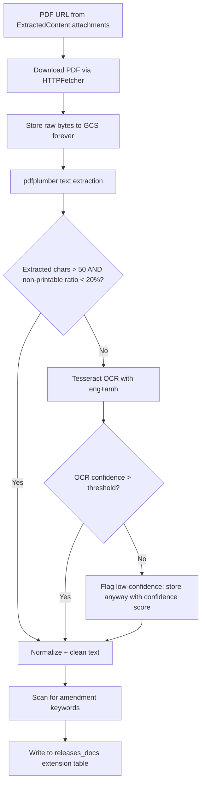

# Phase 4 — PDF Pipeline

**Week:** 4  
**Goal:** Download, store, and extract text from government PDFs. Handle both machine-readable and scanned (image) PDFs. Build the directive amendment graph.  
**Depends on:** Phase 1 (schema — `releases_docs` table), Phase 3 (crawler hands off PDF URLs)

---

## Deliverables

- [ ] PDF downloader with raw byte storage to GCS
- [ ] `pdfplumber` text extraction
- [ ] Tesseract OCR fallback for scanned PDFs (English + Amharic)
- [ ] Text quality checker (decide pdfplumber vs OCR)
- [ ] Directive amendment linker (scan body → write `amends_directive_id`)
- [ ] All raw PDFs permanently stored (never deleted)

---

## Why This Phase Is Critical

Ethiopian government intelligence is primarily PDF-based:

- NBE directives (`/files/fxd-04-2026/`, `/files/sib-62-2026/`)
- MOR proclamations and revenue notices
- MOF budget documents, circulars, tax policy PDFs
- MOJ FIRMA documents

PDFs are the **legal source of truth**. The extracted text will be re-processed as extraction improves — so raw storage is non-negotiable.

---

## Workflow



---

## 1. PDF Downloader (`pipeline/crawler/pdf/downloader.py`)

Uses the same `HTTPFetcher` from Phase 3. PDFs may be large — stream the response.

```python
import gcs  # google-cloud-storage
from pipeline.crawler.fetcher.http import HTTPFetcher

GCS_BUCKET = "berhan-pipeline-raw"
GCS_PDF_PREFIX = "raw_pdfs"

async def download_and_store_pdf(url: str, source_code: str) -> str:
    """Returns GCS path of stored raw PDF."""
    fetcher = HTTPFetcher()
    resp = await fetcher.fetch(url)
    resp.raise_for_status()

    # GCS path: raw_pdfs/NBE/2026/05/fxd-04-2026.pdf
    filename = url.rstrip("/").split("/")[-1] or "document.pdf"
    gcs_path = f"{GCS_PDF_PREFIX}/{source_code}/{filename}"

    bucket = gcs.Client().bucket(GCS_BUCKET)
    blob = bucket.blob(gcs_path)
    blob.upload_from_string(resp.content, content_type="application/pdf")

    return gcs_path
```

**Critical rule:** Raw PDF bytes are stored permanently. Never overwrite. Never delete.

Also capture the original PDF filename — it often encodes the directive number even when the URL does not.

---

## 2. Text Extraction (`pipeline/crawler/pdf/extractor.py`)

### Step 1 — pdfplumber (fast path)

```python
import pdfplumber

def extract_with_pdfplumber(pdf_bytes: bytes) -> str:
    with pdfplumber.open(io.BytesIO(pdf_bytes)) as pdf:
        pages = [page.extract_text() or "" for page in pdf.pages]
    return "\n\n".join(pages)
```

### Step 2 — Quality check

```python
def is_good_extraction(text: str) -> bool:
    if len(text.strip()) < 50:
        return False
    # Non-printable ratio check (scanned PDFs produce garbage chars)
    printable = sum(1 for c in text if c.isprintable() or c in "\n\t")
    ratio = printable / max(len(text), 1)
    return ratio > 0.80
```

If `is_good_extraction` returns False → fall through to Tesseract.

### Step 3 — Tesseract OCR (fallback)

```python
import pytesseract
from pdf2image import convert_from_bytes

def extract_with_ocr(pdf_bytes: bytes) -> tuple[str, float]:
    images = convert_from_bytes(pdf_bytes, dpi=300)
    texts = []
    confidences = []

    for img in images:
        data = pytesseract.image_to_data(
            img,
            lang="eng+amh",
            output_type=pytesseract.Output.DICT,
        )
        page_text = " ".join(w for w, c in zip(data["text"], data["conf"])
                             if int(c) > 0 and w.strip())
        avg_conf = sum(int(c) for c in data["conf"] if int(c) > 0) / max(
            sum(1 for c in data["conf"] if int(c) > 0), 1
        )
        texts.append(page_text)
        confidences.append(avg_conf)

    full_text = "\n\n".join(texts)
    overall_confidence = sum(confidences) / max(len(confidences), 1)
    return full_text, overall_confidence
```

Amharic OCR notes:
- Requires Tesseract `amh` language pack installed: `apt-get install tesseract-ocr-amh`
- Amharic OCR is noisier than English — flag results with confidence < 60% for manual review
- Store OCR output in `releases_docs.ocr_text` even when low confidence

---

## 3. Text Normalization (`pipeline/crawler/pdf/normalizer.py`)

Applied after either pdfplumber or OCR:

```python
import re

def normalize_pdf_text(raw_text: str) -> str:
    # Remove excessive whitespace
    text = re.sub(r'\n{3,}', '\n\n', raw_text)
    text = re.sub(r' {2,}', ' ', text)
    # Remove page headers/footers (common patterns in NBE docs)
    text = re.sub(r'National Bank of Ethiopia\s*Page \d+ of \d+', '', text)
    text = re.sub(r'FEDERAL NEGARIT GAZETTE.*?\n', '', text)
    return text.strip()
```

---

## 4. Directive Amendment Linker (`pipeline/crawler/pdf/amendment_linker.py`)

This is one of the highest-value derived artifacts of the pipeline — a graph of which directive amends/supersedes which.

### Keyword scan

Search normalized text for:

**English:** "amends", "amendment to", "repeals", "supersedes", "as amended by", "in lieu of", "replaces"

**Amharic equivalents:** "ያሻሽላል", "ይሽራል", "ይተካል" (approximate — verify with native speaker)

```python
AMENDS_PATTERNS = [
    r'amends?\s+(?:Directive\s+)?([A-Z]{2,10}[/-]\d{1,4}[/-]\d{4})',
    r'amendment\s+to\s+(?:Directive\s+)?([A-Z]{2,10}[/-]\d{1,4}[/-]\d{4})',
    r'supersedes?\s+(?:Directive\s+)?([A-Z]{2,10}[/-]\d{1,4}[/-]\d{4})',
    r'repeals?\s+(?:Directive\s+)?([A-Z]{2,10}[/-]\d{1,4}[/-]\d{4})',
]

def find_amended_directives(text: str) -> list[str]:
    found = []
    for pattern in AMENDS_PATTERNS:
        found.extend(re.findall(pattern, text, re.IGNORECASE))
    return list(set(found))
```

### Linking

After extraction, for each found directive reference:
1. Look up `releases_docs` where `directive_type_code + directive_number + directive_year` matches
2. If found → write `amends_directive_id` FK on the new document
3. If not found → log as orphaned amendment; add to backfill task

---

## 5. Storage in `releases_docs`

After all extraction steps, write to the extension table:

```python
releases_docs.insert({
    "content_item_id": content_item.id,
    "directive_type_code": meta.get("directive_type_code"),
    "directive_number": meta.get("directive_number"),
    "directive_year": meta.get("directive_year"),
    "pdf_url": original_url,
    "raw_pdf_path": gcs_path,           # permanent GCS path
    "ocr_text": ocr_text_if_used,       # None if pdfplumber succeeded
    "amends_directive_id": resolved_id,  # FK if amendment found
})
```

---

## NBE Directive Type Code Reference

Build a lookup table for categorization on ingestion:

| Code | Category |
|------|----------|
| SBB | Supervision of Banking Business |
| SIB | Supervision of Insurance Business |
| FXD | Foreign Exchange Directive |
| MFI / MBB | Microfinance Business |
| CGFB | Capital Goods Finance Business |
| PSD | Payment System |
| FIS | Financial Inclusion |
| SMIB | Microinsurance Business |
| CMD | Currency Management |
| OMO | Open Market Operations |
| FIS_SUP | Financial Institutions Supervision |
| CRB | Credit Reference Bureau |
| MCR | Movable Collateral Registry |
| NBE_INT | Interest Rate Directives |

---

## Completion Checklist

- [ ] Raw PDFs stored to GCS before any extraction attempt
- [ ] `pdfplumber` extracts text from a non-scanned NBE directive correctly
- [ ] Text quality check correctly identifies scanned PDFs (test with known scanned MOR doc)
- [ ] Tesseract OCR runs with `eng+amh` language pack installed
- [ ] Amharic OCR output stored even when confidence is low
- [ ] Amendment regex matches `FXD/04/2026 amends FXD/01/2024` pattern
- [ ] `amends_directive_id` FK written correctly on at least one known amendment pair
- [ ] Orphaned amendment references logged and queued for backfill
- [ ] `releases_docs.raw_pdf_path` populated for every processed PDF
