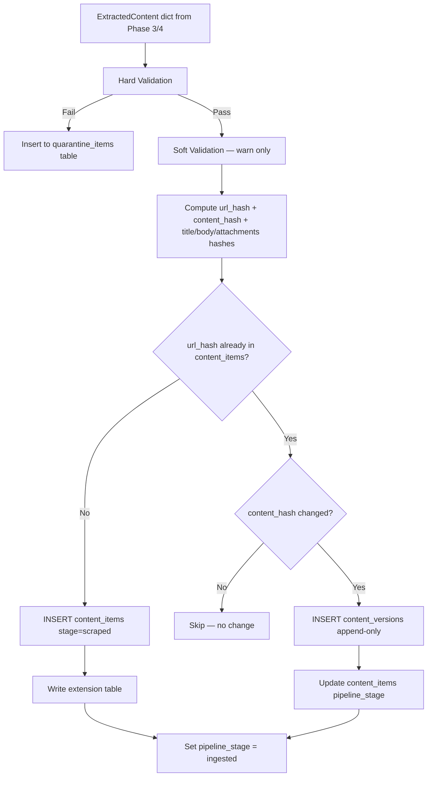

# Phase 5 — Ingestion Layer

**Week:** 4  
**Goal:** Persist extracted content with two-layer deduplication, append-only versioning, pipeline stage tracking, and hard/soft validation.  
**Depends on:** Phase 1 (schema), Phase 3 (ExtractedContent dict), Phase 4 (PDF output)

---

## Deliverables

- [ ] Content deduplication (url_hash + content_hash)
- [ ] Append-only version tracking (`content_versions`)
- [ ] Pipeline stage progression logic
- [ ] Hard validation (quarantine on fail)
- [ ] Soft validation (warn, don't block)
- [ ] Quarantine queue table/handler
- [ ] Extension table writers (articles, announcements, releases_docs)

---

## Ingestion Flow



---

## 1. Hashing

All hashes use `hashlib.sha256`. Computed before any DB write.

```python
import hashlib

def content_hash(title: str, body: str) -> str:
    normalized = (title.strip().lower() + body.strip().lower())
    return hashlib.sha256(normalized.encode()).hexdigest()

def url_hash(normalized_url: str) -> str:
    return hashlib.sha256(normalized_url.encode()).hexdigest()

def title_hash(title: str) -> str:
    return hashlib.sha256(title.strip().lower().encode()).hexdigest()

def body_hash(body: str) -> str:
    return hashlib.sha256(body.strip().lower().encode()).hexdigest()

def attachments_hash(attachments: list[dict]) -> str:
    urls = sorted(a["url"] for a in attachments)
    return hashlib.sha256("|".join(urls).encode()).hexdigest()
```

Hashing title and body separately allows change-type classification:
- `title_hash` changed only → title edit
- `body_hash` changed only → content update
- `attachments_hash` changed only → new PDF attached
- Multiple changed → compound update

---

## 2. Deduplication Strategy

### Layer 1 — URL deduplication

At spider stage (Phase 2): `discovered_urls.url_hash` uses `ON CONFLICT DO NOTHING`.

At ingestion stage: check `content_items.url_hash` before insert.

Canonical URL resolution order:
1. `og:url` meta tag (most reliable for Django/WordPress sites)
2. `rel=canonical` link tag
3. Final URL after all redirects (from `httpx` response history)
4. Fallback: original URL from `discovered_urls`

### Layer 2 — Content deduplication

Same article appearing in RSS + sitemap + listing page → same `content_hash` → deduplicated.

```python
async def upsert_content_item(session, extracted: ExtractedContent, source_id, crawl_job_id):
    c_hash = content_hash(extracted.title, extracted.content)
    u_hash = url_hash(extracted.canonical_url)

    existing = await session.execute(
        select(ContentItem).where(ContentItem.url_hash == u_hash)
    )
    existing = existing.scalar_one_or_none()

    if existing is None:
        # New item
        item = ContentItem(
            source_id=source_id,
            url_hash=u_hash,
            content_hash=c_hash,
            title=extracted.title,
            raw_content=extracted.raw_html,
            extracted_content=extracted.content,
            language=extracted.language,
            published_at=extracted.published_at,
            pipeline_stage=PipelineStage.scraped,
            crawl_job_id=crawl_job_id,
        )
        session.add(item)
        await session.flush()
        return item, "created"

    if existing.content_hash != c_hash:
        # Content changed — append version snapshot
        await insert_version(session, existing, c_hash, extracted)
        return existing, "updated"

    return existing, "unchanged"
```

---

## 3. Version Tracking (`pipeline/ingestion/versions/`)

**Rule:** Never UPDATE `content_items`. Always append to `content_versions`.

```python
async def insert_version(session, item: ContentItem, new_hash: str, extracted: ExtractedContent):
    # Get current max version number
    result = await session.execute(
        select(func.max(ContentVersion.version))
        .where(ContentVersion.content_item_id == item.id)
    )
    current_max = result.scalar() or 0

    version = ContentVersion(
        content_item_id=item.id,
        version=current_max + 1,
        content_hash=new_hash,
        title_hash=title_hash(extracted.title),
        body_hash=body_hash(extracted.content),
        attachments_hash=attachments_hash(extracted.attachments),
        raw_html_path=store_raw_html_to_gcs(extracted.raw_html, item.id, current_max + 1),
        created_at=datetime.utcnow(),
    )
    session.add(version)
    # Update the parent item's current hash
    item.content_hash = new_hash
    item.pipeline_stage = PipelineStage.processed
```

Each version snapshot also stores the raw HTML to GCS — enables replay of extraction without recrawling.

---

## 4. Pipeline Stage Progression

```
scraped → processed → ingested → published
```

| Stage | Set when |
|-------|----------|
| `scraped` | Row first inserted into `content_items` |
| `processed` | Content extracted + language detected + extension table written |
| `ingested` | Validation passed + all writes committed |
| `published` | Downstream consumer (API, search, etc.) has picked up the item |

Stage is a one-way progression. Never go backwards.

---

## 5. Extension Table Writers

### Articles

For `content_type` in `{article, press_release}`:

```python
session.add(Article(
    content_item_id=item.id,
    author=extracted.author,
    excerpt=extracted.content[:300] if extracted.content else None,
    image_url=next((a["url"] for a in extracted.attachments if a["type"] == "image"), None),
    word_count=len(extracted.content.split()) if extracted.content else 0,
))
```

### Announcements

For `content_type` in `{announcement, release}`:

```python
session.add(Announcement(
    content_item_id=item.id,
    institution_code=source.code,
    announcement_type=extracted.directive_type_code or "general",
    reference_number=extracted.directive_number,
))
```

### Releases / Docs

For `content_type` in `{proclamation, document}` or when PDF attachments exist:

```python
session.add(ReleaseDoc(
    content_item_id=item.id,
    directive_type_code=extracted.directive_type_code,
    directive_number=extracted.directive_number,
    directive_year=extracted.directive_year,
    pdf_url=pdf_attachment["url"] if pdf_attachment else None,
    raw_pdf_path=gcs_pdf_path,           # from Phase 4
    ocr_text=ocr_text,                   # from Phase 4 if scanned
    amends_directive_id=resolved_amendment_id,
))
```

---

## 6. Validation

### Hard Validation (quarantine on fail)

```python
def hard_validate(extracted: ExtractedContent, source: Source) -> list[str]:
    errors = []
    if not extracted.canonical_url:
        errors.append("missing canonical_url")
    elif not extracted.canonical_url.startswith("https://"):
        errors.append("canonical_url not https")
    if not extracted.title or len(extracted.title) > 1000:
        errors.append("title missing or too long")
    if extracted.published_at:
        if not (date(2000, 1, 1) <= extracted.published_at.date() <= date.today() + timedelta(days=30)):
            errors.append("published_at out of range")
    return errors
```

Failures → insert into `quarantine_items` table with `reason`, `raw_html`, `source_id`, `url`. Do not silently drop.

### Soft Validation (warn only, log to structured log)

```python
def soft_validate(extracted: ExtractedContent) -> list[str]:
    warnings = []
    if len(extracted.content or "") < 100:
        warnings.append("body_text_too_short")
    if extracted.title and extracted.title == extracted.raw_html[:len(extracted.title)]:
        warnings.append("title_may_be_nav_chrome")
    if extracted.directive_type_code and not extracted.directive_number:
        warnings.append("directive_type_without_number")
    return warnings
```

---

## 7. Quarantine Table

Schema addition (add to Phase 1 migration or create `002_quarantine.py`):

```sql
CREATE TABLE quarantine_items (
    id UUID PRIMARY KEY DEFAULT gen_random_uuid(),
    source_id UUID REFERENCES sources(id),
    url TEXT,
    raw_html TEXT,
    failure_reason TEXT,
    created_at TIMESTAMPTZ DEFAULT now(),
    resolved BOOLEAN DEFAULT false,
    resolved_at TIMESTAMPTZ
);
```

---

## Completion Checklist

- [ ] `url_hash` dedup prevents duplicate inserts (test same URL twice)
- [ ] `content_hash` dedup prevents duplicate content from RSS + sitemap for same article
- [ ] `content_versions` row created when content_hash changes on re-crawl
- [ ] Version row contains `title_hash`, `body_hash`, `attachments_hash` separately
- [ ] Raw HTML GCS path stored in `content_versions.raw_html_path`
- [ ] `pipeline_stage` advances correctly: scraped → processed → ingested
- [ ] Hard validation rejects malformed records to quarantine table
- [ ] Quarantine records inspectable (not silently dropped)
- [ ] Soft validation warnings appear in structured logs
- [ ] Extension table written for every new `content_items` row
