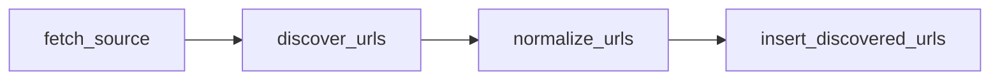
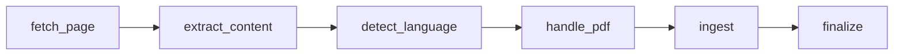

# Phase 6 — Hatchet Workflows

**Week:** 5  
**Goal:** Wire all phases together into two Hatchet workflows (Spider + Crawler). Hatchet orchestrates — all business logic stays in the Python modules built in Phases 2–5.  
**Depends on:** Phases 1–5 fully working in isolation

---

## Deliverables

- [ ] `pipeline/workflows/spider_workflow.py` — 4 steps
- [ ] `pipeline/workflows/crawler_workflow.py` — 6 steps
- [ ] Hatchet worker registration (`pipeline/worker.py`)
- [ ] Each step is small, idempotent, and retry-safe
- [ ] `crawl_jobs` audit rows written by each step
- [ ] End-to-end test: spider run → discovered_urls → crawler run → content_items

---

## Design Principle

```
Hatchet = orchestration only
Python modules = all business logic
```

Hatchet steps should be thin wrappers that:
1. Load inputs from DB
2. Call the relevant Python function
3. Write results back to DB
4. Return output for the next step

No extraction logic, no parsing, no hashing inside workflow files.

---

## Spider Workflow

**File:** `pipeline/workflows/spider_workflow.py`

**Triggered by:** `crawl_schedule` cron — one run per source per schedule tick.



### Steps

#### Step 1: `fetch_source`

Input: `source_id` (from schedule)

```python
@hatchet.step()
async def fetch_source(self, ctx: Context) -> dict:
    source_id = ctx.workflow_input()["source_id"]
    async with get_session() as session:
        source = await session.get(Source, source_id)
        crawl_state = await session.get(SourceCrawlState, source_id)

    await write_crawl_job(session, source_id, ctx.workflow_run_id, "fetch_source", JobStatus.running)

    return {
        "source": source.to_dict(),
        "crawl_state": crawl_state.to_dict(),
        "run_id": ctx.workflow_run_id,
    }
```

#### Step 2: `discover_urls`

Input: output from `fetch_source`

```python
@hatchet.step(parents=["fetch_source"])
async def discover_urls(self, ctx: Context) -> dict:
    source_data = ctx.step_output("fetch_source")["source"]
    source = Source(**source_data)

    adapter = get_adapter(source.source_type)  # factory: RSS / Sitemap / WP / Liferay / FIRMA
    raw_urls = await adapter.discover_urls(source)

    return {"raw_urls": raw_urls, "source_id": source_data["id"]}
```

#### Step 3: `normalize_urls`

Input: output from `discover_urls`

```python
@hatchet.step(parents=["discover_urls"])
async def normalize_urls(self, ctx: Context) -> dict:
    raw_urls = ctx.step_output("discover_urls")["raw_urls"]
    normalized = []
    for url in raw_urls:
        norm = normalize_url(url)
        hash_ = url_hash(norm)
        meta = extract_directive_meta(urllib.parse.urlparse(url).path)
        normalized.append({"url": norm, "hash": hash_, "meta": meta})
    return {"normalized_urls": normalized}
```

#### Step 4: `insert_discovered_urls`

Input: output from `normalize_urls`

```python
@hatchet.step(parents=["normalize_urls"])
async def insert_discovered_urls(self, ctx: Context) -> dict:
    normalized = ctx.step_output("normalize_urls")["normalized_urls"]
    source_id = ctx.step_output("discover_urls")["source_id"]
    run_id = ctx.step_output("fetch_source")["run_id"]

    inserted = 0
    async with get_session() as session:
        for item in normalized:
            result = await insert_discovered_url(session, source_id, item["url"], item["meta"])
            if result == "inserted":
                inserted += 1

        await update_crawl_job(session, run_id, "insert_discovered_urls",
                               JobStatus.completed, stats={"urls_found": len(normalized), "urls_inserted": inserted})
        await update_source_crawl_state(session, source_id, success=True)
        await session.commit()

    return {"inserted": inserted, "total": len(normalized)}
```

---

## Crawler Workflow

**File:** `pipeline/workflows/crawler_workflow.py`

**Triggered by:** Polling `discovered_urls WHERE crawled_at IS NULL` — one run per URL.



### Steps

#### Step 1: `fetch_page`

```python
@hatchet.step()
async def fetch_page(self, ctx: Context) -> dict:
    url = ctx.workflow_input()["url"]
    discovered_url_id = ctx.workflow_input()["discovered_url_id"]

    fetcher = HTTPFetcher()
    resp = await fetcher.fetch(url)

    return {
        "html": resp.text,
        "status_code": resp.status_code,
        "final_url": str(resp.url),
        "discovered_url_id": discovered_url_id,
    }
```

#### Step 2: `extract_content`

```python
@hatchet.step(parents=["fetch_page"])
async def extract_content(self, ctx: Context) -> dict:
    page_data = ctx.step_output("fetch_page")
    source_code = ctx.workflow_input()["source_code"]

    extractor = get_extractor(source_code)  # factory: NBE / MOF / Liferay / FIRMA / readability
    extracted = extractor.extract(page_data["html"], page_data["final_url"])

    if extracted is None:
        # Shadow extractor fallback
        extracted = shadow_extractor.extract(page_data["html"], page_data["final_url"])
        extracted._shadow = True  # flag for review queue routing

    return {"extracted": extracted.to_dict()}
```

#### Step 3: `detect_language`

```python
@hatchet.step(parents=["extract_content"])
async def detect_language(self, ctx: Context) -> dict:
    extracted = ctx.step_output("extract_content")["extracted"]
    lang = detect_language(extracted["content"] or extracted["title"])
    extracted["language"] = lang
    return {"extracted": extracted}
```

#### Step 4: `handle_pdf`

Runs only if `extracted.attachments` contains PDF entries.

```python
@hatchet.step(parents=["detect_language"])
async def handle_pdf(self, ctx: Context) -> dict:
    extracted = ctx.step_output("detect_language")["extracted"]
    pdf_results = []

    for attachment in extracted.get("attachments", []):
        if attachment["type"] != "pdf":
            continue
        gcs_path = await download_and_store_pdf(attachment["url"], ctx.workflow_input()["source_code"])
        text, ocr_used = await extract_pdf_text(gcs_path)
        amended = find_amended_directives(text)
        pdf_results.append({
            "url": attachment["url"],
            "gcs_path": gcs_path,
            "text": text,
            "ocr_used": ocr_used,
            "amended_directives": amended,
        })

    return {"extracted": extracted, "pdf_results": pdf_results}
```

This step is idempotent: if the PDF is already stored in GCS, skip the download.

#### Step 5: `ingest`

```python
@hatchet.step(parents=["handle_pdf"])
async def ingest(self, ctx: Context) -> dict:
    extracted_dict = ctx.step_output("handle_pdf")["extracted"]
    pdf_results = ctx.step_output("handle_pdf")["pdf_results"]
    source_id = ctx.workflow_input()["source_id"]
    crawl_job_id = ctx.workflow_input()["crawl_job_id"]

    extracted = ExtractedContent(**extracted_dict)

    # Route shadow extractor output to review queue
    if getattr(extracted, "_shadow", False):
        await insert_quarantine(session, extracted, "shadow_extractor")
        return {"status": "quarantined"}

    errors = hard_validate(extracted)
    if errors:
        await insert_quarantine(session, extracted, ", ".join(errors))
        return {"status": "quarantined", "reasons": errors}

    warnings = soft_validate(extracted)
    if warnings:
        logger.warning(f"Soft validation warnings: {warnings}")

    async with get_session() as session:
        item, action = await upsert_content_item(session, extracted, source_id, crawl_job_id)
        if action in ("created", "updated"):
            await write_extension_table(session, item, extracted, pdf_results)
        await session.commit()

    return {"status": action, "content_item_id": str(item.id)}
```

#### Step 6: `finalize`

```python
@hatchet.step(parents=["ingest"])
async def finalize(self, ctx: Context) -> dict:
    ingest_result = ctx.step_output("ingest")
    discovered_url_id = ctx.step_output("fetch_page")["discovered_url_id"]
    run_id = ctx.workflow_input()["crawl_job_id"]

    async with get_session() as session:
        # Mark URL as crawled
        await session.execute(
            update(DiscoveredUrl)
            .where(DiscoveredUrl.id == discovered_url_id)
            .values(crawled_at=datetime.utcnow())
        )
        # Update crawl job
        await update_crawl_job(session, run_id, "finalize", JobStatus.completed,
                               stats={"action": ingest_result["status"]})
        # Update source health
        await update_source_crawl_state(session, ctx.workflow_input()["source_id"], success=True)
        await session.commit()

    return {"done": True}
```

---

## Worker Registration (`pipeline/worker.py`)

```python
from hatchet_sdk import Hatchet
from pipeline.workflows.spider_workflow import SpiderWorkflow
from pipeline.workflows.crawler_workflow import CrawlerWorkflow

hatchet = Hatchet()
worker = hatchet.worker("berhan-pipeline-worker")
worker.register_workflow(SpiderWorkflow())
worker.register_workflow(CrawlerWorkflow())

if __name__ == "__main__":
    worker.start()
```

---

## Idempotency Rules

Every step must be safe to retry without side effects:

| Step | Idempotency mechanism |
|------|-----------------------|
| `fetch_source` | Read-only DB query |
| `discover_urls` | Adapter is stateless |
| `normalize_urls` | Pure function |
| `insert_discovered_urls` | `ON CONFLICT DO NOTHING` |
| `fetch_page` | HTTP GET is idempotent |
| `extract_content` | Pure function |
| `detect_language` | Pure function |
| `handle_pdf` | GCS write checked before download |
| `ingest` | `ON CONFLICT DO NOTHING` on url_hash |
| `finalize` | `crawled_at` update is idempotent |

---

## Completion Checklist

- [ ] Spider workflow runs end-to-end for NBE source: `crawl_schedule` → `discovered_urls` populated
- [ ] Crawler workflow runs end-to-end for a single NBE article URL: `discovered_urls` → `content_items` populated
- [ ] `crawl_jobs` rows created with correct `hatchet_run_id`, `hatchet_step`, `status`
- [ ] Step retry does not create duplicate DB rows
- [ ] Hatchet dashboard shows workflow timeline for both workflows
- [ ] Shadow extractor routing to quarantine verified
- [ ] PDF step skipped cleanly when no PDF attachments
